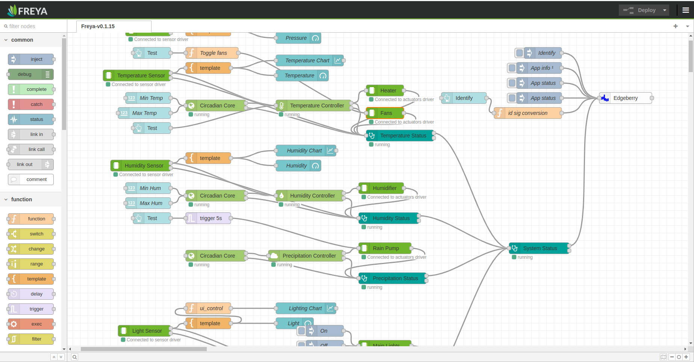

The **Node-RED flow** with the Freya Vivarium Control System functionality.

## Usage
1. Open [Freya_flows.json](Freya_flows.json) file here on GitHub, and click the `Copy raw file` button.
2. Open your Node-RED editor (usually http://[ip address]:1880).
3. In the top-right menu, select `≡ → Import → Clipboard`.
4. Paste the copied content into the dialog and click `Import`.
5. Click `Deploy` to activate the flow. Check the Debug sidebar or your configured outputs to verify everything is running.
6. Open the `Dashboard` at http://[ip address]:1880/ui/

